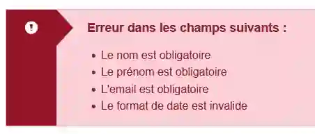
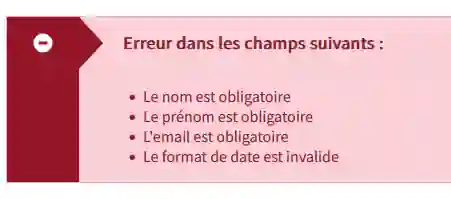

# Migration from @axa-fr/react-toolkit

If you are using `@axa-fr/react-toolkit` and want to migrate to
`@axa-fr/design-system`, you can follow this guide. Most components work the
same way, and migrating _should_ be painless. There are however a few
exceptions.

## Tooling changes

### React 17

Support for react 17 has been dropped. This package now requires react 18 or
higher.

### 👋 CSS imports

Importing CSS is no longer required as components bring their own styles. You
can remove the following line from your project:

```diff
- import '@axa-fr/react-toolkit-all/dist/style/af-toolkit-core.css';
- import '@axa-fr/react-toolkit-core/dist/assets/fonts/icons/af-icons.css';
```

However we now require sass support in your project. If you don't have it, you
can install it with:

```bash
npm install sass
```

If you are using vite, it will automatically pickup on sass being present.

## Visual changes

### Alert

The default icon for the `Alert` in error component has changed. It now uses the
glyphicon `glyphicon-minus-sign` instead of `glyphicon-exclamation-sign`.

Before:



After:



## Deleted components

### 🚮 CardGroupCheckbox and CardGroupRadio

The `CardGroupCheckbox` and `CardGroupRadio` components have been removed. They
were barely used and UX designers have decided to remove them.

### 🚮 FileLine

The `FileLine` component has been removed.

### 🚮 SwitchInput

The `SwitchInput` component has been removed.

## Props breaking changes

### 👮‍♂️ Multiselect

The `Multiselect` component now enforces stricter prop types for the `options`.
It used to accept any object, but now it requires an object with **only** a
`label` and `value` property. Any other property was ignored so there was no
point in allowing them.

### 🧹 Steps

The `Steps` component has been updated to _only_ have the new look. The old look
was already deprecated in the toolkit package and has now been removed.

### 🧹 Popover

The `Popover` component has been updated to use string unions for the `mode` and
`placement` props intead of enums. Also `Popover.Pop` and `Popover.Over` have
been removed. Now the `popoverElement` is the content inside the popover, and
`children` is now the content that will trigger the popover.

Placement are now more complete and can be all allowed values in
[popper.js](https://popper.js.org/docs/v2/constructors/#options).

Here's a example of how to update your code:

```diff
<Popover
-    mode={PopoverModes.hover} placement={PopoverPlacement.top}
+    mode="hover" placement="top"
+    popoverElement={
+      <>
+        <h1>Content of the popover</h1>
+        <p>Text of the modal element</p>
+      </>
>
- <Popover.Pop>
-    <h1>Content for the popover</h1>
-    <p>modal text</p>
- </Popover.Pop>
- <Popover.Over>
    <div
        hovered element
    </div>
-</Popover.Over>
</Popover>
```

### 🧹 HelpButton

The `HelpButton` component has been updated to use string unions for the `mode`
and `placement` props intead of enums just like `Popover`.
