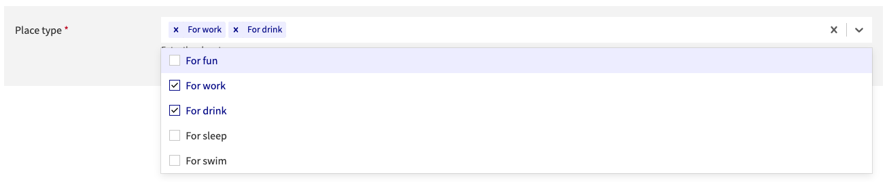

# Release Notes for Slash 2.0.0

## Breaking Changes

### Button component

The `Button` component has been updated to include new styles and props. The
following changes have been made:

- Added a new `variant` prop to allow for different button styles (`primary`
  (default variant), `secondary`, `validated`, `danger`, `ghost` and
  `ghost-reverse`). The `variant` property replace the `classModifier` property.
  `classModifier` SHOULDN'T be used for this component anymore.
- The introduction of the `variant` changes also how `className` works. When
  passing a className to change the appearance of the button (this should be a
  rare exception, projects should always use the style exported by the design
  system), you don't need to pass the `af-btn` className anymore. Your className
  will be added to the `af-btn`.
- Updated the default button styles to match the new design guidelines.

Example :

Before, you used to do something like that for a success button :

```tsx
<Button classModifier="success">Button</Button>
```

Now you will do it like that :

```tsx
<Button variant="validated">Button</Button>
```

The style of each variant are as follow :

- `primary`: AXA blue color
- `secondary`: White color with blue text (previously named `reverse`)
- `validated`: Green color (previously named `success`)
- `danger`: Red color
- `ghost`: Transparent background and no border with blue text
- `ghost-reverse`: Transparent background and no border with white text

If you have icon(s) inside your `Button`, previously you used to add your icon
as `children` of the component and add the `classModifier` `hasiconLeft` or
`hasiconRight` depending on where you wanted your icon to be placed. Now it is
easier, you can use the `leftIcon` or `rightIcon` prop to pass your icon
directly.

```tsx
<Button leftIcon={<i className="glyphicon glyphicon-arrow-left" />}>
  With left glyphicon icon
</Button>
```

You can find the style of each variant on the storybook and a deeper
documentation for the migration of the button component
[here](./MIGRATION-GUIDE-FROM-V1.md)

### Rename color tokens

In order to match the exact token name of the UX designers, we have renamed two
design tokens.

- `--green40` is now named `--green30`
- `--green50` is now named `--green40`

If you are using those tokens inside your application, review your usage and
update any references accordingly.

## Added

### Card component

A new `Card` component has been added to the design system. This component is
used to display content in a card format, with a content and optional image. The
`orientation` property allows to switch the component between `vertical` and
`horizontal`. As this component acts as a button, you can use an `onClick`
handler.

```jsx
<Card id="id" onClick={() => action()} iconSrc={villaIcon}>
  Contenu
</Card>
```


### VerticalStep component

The `VerticalStep` component allows you to create a step in a vertical stepper.
It is designed to be used in forms or processes where you need to guide the user
through multiple steps, each with its own content and actions. The application
have the responsibility for the state of the mode of each VerticalStep and the
change of those states. The `form` property allows you to pass a form element
that will be displayed in the step. The `restitution` property allows you to
pass a restitution element that will be displayed when the step's mode is
`validated`.

NB: `VerticalStep` component allows a `contentRight` but only as string.

```tsx
export const Component = () => {
  const [configurationStepMode, setConfigurationStepMode] = useState("locked");

  return (
    <VerticalStep
      title="Configuration"
      id="configurationStepTitle"
      stepMode={configurationStepMode}
      onEdit={() => setConfigurationStepMode("edited")}
      form={
        <form>
          <fieldset>
            <legend className={globalCss.cacherLegende}>
              Formulaire Configuration
            </legend>
            <TextInput
              id="dateEffet"
              name="dateEffet"
              label="Date d'effet"
              classModifier="required"
              value={dateEffetFormatFr}
              helpMessage="jj/mm/aaaa"
            />
            <BoutonConfirmation
              id="validation-configuration"
              titre="Valider"
              actionAuClique={submit}
            />
          </fieldset>
        </form>
      }
      restitution={<p>Restitution</p>}
    />
  );
};
```


### AnchorNavBar for HeaderTitle

`HeaderTitle` now supports an `anchorNavBarItems` property that allows you to
create a navigation bar anchored to the header title. This is useful for
providing quick access to different sections of the page.

The `anchorNavBarItems` property is an array of objects with the following
structure:

```tsx
interface AnchorNavBarItem {
  name: string; // The name of the item
  isActive?: boolean; // Optional, if true, the item will be highlighted as active
  onClick?: () => void; // Optional, if provided, will be called when the item is clicked
  link?: string; // Optional, the link to navigate to
  externalLink?: boolean; // Optional, if true, an icon will be displayed to indicate that the link is external
  render?: (props: any) => React.ReactNode; // Optional, if provided, will render the item using the provided function
}
```

Here's an example :

```tsx
const TitleComponent = () => (
  <HeaderTitle
    isSticky
    title="Toolkit Axa"
    subtitle="Info complémentaire"
    toggleMenu={() => {}}
    anchorNavBarItems={[
      { name: "Home", link: "#home" },
      { name: "About", link: "#about" },
      { name: "Services", link: "/services", externalLink: true },
      {
        name: "Contact",
        render: (props) => (
          <a {...props} href="#contact">
            Contact
          </a>
        ),
      },
    ]}
  />
);
export default TitleComponent;
```


### Divider component

The `Divider` component is a simple horizontal line that can be used to separate
content within a layout. You can use the `mode` property to control its
orientation (e.g., `horizontal`, `vertical`).

### Container component

The `Container` component is a layout component that provides a responsive
container. It can be used to wrap content, apply consistent margins and set
correct background color so that you don't have to repeat these styles in your
different projects. To use it, import the `Container` component and wrap your
content with it. The component sets a `main` html element.

```tsx
<Container>
  <p>Your application's main content goes here</p>
</Container>
```

### Tag component

The `Tag` component is a new component that replaces the deprecated `Badge`
component. It is used to display a label inside a block of color. You can use
the `variant` prop to apply different styles to the tag. The values for the
`variant` prop are as follow:

- `success`
- `information`
- `warning`
- `error`
- `default`
- `dark`
- `purple`
- `gray`

```tsx
<Tag variant="success">Lorem ipsum</Tag>
```

#### Backward compatibility

To ensure backward compatibility, the `Tag` component also supports the
`classModifier` prop with the previous values (`success`, `info`, `danger`,
`error`). **However this is deprecated and you should use the `variant` prop
instead. **

### CardData component

The `CardData` component is used to display a card with a title, an icon, and
content. It can also include a subtitle, a description and additional content on
the right side of the header.

The content can either take all space available or have specific margins (which
is the default mode). If you want content to take all size, use the
`contentFitAllSize` property.

The `icon` has a background color that can be set with the `variant` property
with one of this value : `error`, `warning`, `information`, `success`,
`default`, `dark`, `gray`, and `purple`.

Also, you can remove the divider between the `header` and the `content` of the
card by setting the `withDivider` property to `false`.

```tsx
import Svg from "@/assets/ton_svg.svg";

export const Component = () => (
  <CardData title="Titre de la carte" icon={Svg} variant="error">
    <p>Contenu de la carte</p>
  </CardData>
);
```


## Improvements

### Content on HeaderTitle

The `HeaderTitle` component now has a contentLeft property that allows you to
add content to the left side of the title which wasn't possible before. We used
to be able to add content at the right with the `children` property, we now
support two different solutions. The `children` property is still available and
add content at the right side of the title. To add content at the far right of
the title bar, you can use the `contentRight` property.


### Accordion white variant

The `Accordion` has now a new `white` variant that allows you to use the
component with a white background. To do so use the `classModifier` property
with the value `white`.

### Radio has a new card mode

The `Radio` component now has a new card mode that allows you to display radio
buttons as cards. To enable this mode, use the `mode` property with the value
`card`. You can then use the `orientation` property to control the layout of the
cards (horizontal or vertical).

```tsx
const options = [
  { label: "Paris", value: "paris", icon: villaIcon },
  { label: "Lille", value: "lille", icon: villaIcon },
  { label: "Madrid", value: "madrid", icon: villaIcon },
];

const MyRadioCard = () => <Radio mode="card" options={options} />;
```


### Accessibility

### Miscellaneous

- All inputs components have been updated to use the new design tokens. The
  colors are now aligned with the expected design.
- `Button` has the correct design (color, spacings).
- `Steps` has the correct design (font, color, spacings, icons).
- `Message` has the correct design (font, color, spacings, icons).
- `MultiSelect` now has the correct design validated by the UX designers. Here's
  an example of the new look of that component.



- `Modal` has the correct design (color, spacings).

#### Add ariaLabel for Pager and Paging components

The property `selectPageSizeLabel` has been added to the `Paging` component and
allows screen readers to announce the purpose of the page size selector.

```jsx
<Paging
  currentPage={2}
  elementsLabel="sinistres"
  items={[5, 10]}
  selectPageSizeLabel="Nombre de sinistres à afficher"
  numberPages={10}
/>
```

The property `elementsLabel` has been added to the `Pager` component to describe
the element being paginated. The property is then used on each navigation number
link and on each pagination button (previous and next buttons). By default, this
property has the value `éléments`.

```jsx
<Pager currentPage={2} elementsLabel="sinistres" numberPages={10} />
```

## Deprecations

- `Alert` component is deprecated in favor of the new `Message` component.
- `Badge` component is deprecated in favor of the new `Tag` component.
- For the `Badge` component, `classModifier` `danger` and `info` are deprecated
  in favor of `warning` and `information`, respectively.
